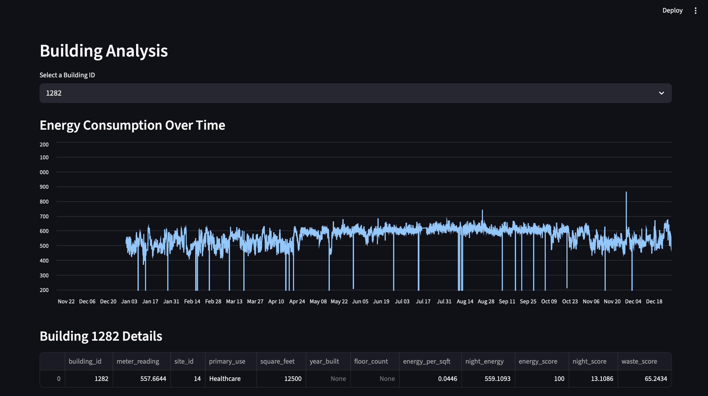

# ⚡ EnerSight

## AI-Powered Energy Intelligence for Smarter Buildings

EnerSight is an energy analytics platform that detects building energy inefficiencies using real-world energy consumption data.

The system analyzes energy usage patterns, calculates energy waste scores, predicts expected energy consumption, and provides actionable insights through an interactive dashboard.

---

# 🌐 Live Demo

🚀 **Launch the live dashboard here:**

👉 https://enersight-dashboard.streamlit.app/
---

# 📊 Dashboard Preview

## Main Dashboard


## Building Analysis



## Waste Ranking


---

# 🚀 Features

## Energy Waste Detection

- Calculates building energy efficiency metrics
- Identifies buildings with unusually high energy consumption
- Generates waste score rankings
- Detects potential energy waste patterns

## Machine Learning Energy Prediction

- Predicts expected energy consumption
- Compares predicted and actual usage
- Identifies abnormal energy behavior

## Interactive Dashboard

- Displays key energy performance metrics
- Allows building-level analysis
- Shows energy consumption trends
- Provides energy-saving recommendations

---

# 🧠 How It Works

1. Energy consumption data is loaded and processed.
2. Building characteristics and weather information are analyzed.
3. Energy efficiency metrics are calculated.
4. Buildings are ranked using a waste score.
5. Machine learning models estimate expected energy usage.
6. Results are displayed through a Streamlit dashboard.

---

# 🛠️ Technologies Used

- Python
- Pandas
- NumPy
- Scikit-learn
- Matplotlib
- Streamlit
- Git & GitHub

---

# 📂 Project Structure


EnerSight/
│
├── assets/
│ └── logo.png
│
├── data/
│
├── graphs/
│
├── reports/
│ └── waste_scores.csv
│
├── screenshots/
│ ├── dashboard_overview.png
│ ├── building_analysis.png
│ └── waste_ranking.png
│
├── src/
│ ├── analysis.py
│ ├── waste_detector.py
│ ├── energy_model.py
│ └── dashboard.py
│
├── requirements.txt
└── README.md


---

# ▶️ Installation & Usage

Clone the repository:

```bash
git clone <repository-link>

Install dependencies:

pip install -r requirements.txt

Run the dashboard:

streamlit run src/dashboard.py
📚 Dataset

EnerSight uses the ASHRAE Great Energy Predictor III dataset.

The dataset includes:

Building energy consumption records
Building metadata
Weather information
🔮 Future Improvements
Allow users to upload their own building energy data
Integrate real-time IoT energy sensors
Improve prediction accuracy
Add automated energy-saving recommendations
Expand analysis to additional building systems
👩‍💻 Author

Anushka Ahsan

Electrical Engineering Student

Interested in embedded systems, control systems, and energy technology.

